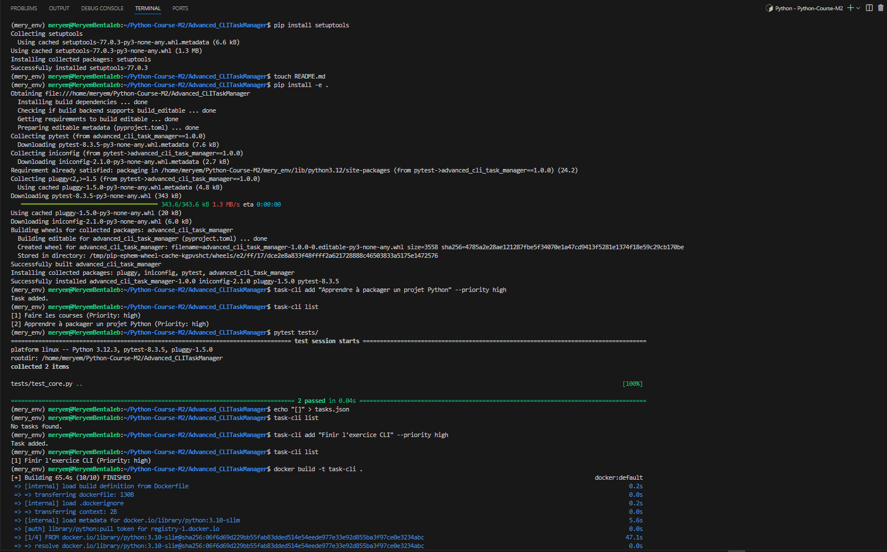

# Advanced CLI Task Manager

A command-line task manager written in Python using `argparse`. This project includes subcommands (`add`, `list`, `delete`), logging, JSON file persistence, environment variable support, Docker support, and unit tests.

---

## 🚀 Features

✅ Add, list, and delete tasks via subcommands  
✅ Tasks saved in a JSON file (`tasks.json`)  
✅ Logs every action to `logs/task_manager.log`  
✅ Uses `TASKS_FILE_PATH` env var to locate task file  
✅ Unit tests included with `pytest`  
✅ Dockerized for container-based usage  
✅ Packaged for local installation with `pip install -e .`

---
---

---

## 🛠 Folder Structure

```plaintext
advanced_cli_task_manager/
│── task_manager/
│   │── __init__.py
│   │── cli.py             # CLI entry point
│   │── core.py            # Core task logic
│   │── config.py          # (optional future config file)
│   │── logger.py          # Logging configuration
│── tests/
│   │── test_core.py       # Unit tests
│── tasks.json             # Tasks database (JSON format)
│── requirements.txt       # Dev dependencies
│── setup.py               # Packaging configuration
│── Dockerfile             # Docker support
│── README.md              # Documentation (this file)
```

---

## ⚙️ Installation & Setup

### ✅ 1. Cloner le projet
```bash
git https://github.com/MeryembentalebEJ/Python-Course-M2.git
cd advanced-cli-task-manager
```

### ✅ 2. Créer un environnement virtuel
```bash
python -m venv venv
source venv/bin/activate  # sous Windows : venv\Scripts\activate
```

### ✅ 3. Installer les dépendances
```bash
pip install -e .
```

### ✅ 4. Créer le fichier `tasks.json`
```bash
echo "[]" > tasks.json
```

Tu peux maintenant utiliser la commande :
```bash
task-cli add "Faire les courses" --priority high
task-cli list
task-cli delete 1
```

---

## 🧪 Tests unitaires

```bash
pytest tests/
```
Résultat attendu : `2 passed` ✅

---

## 🐳 Docker (optionnel)

### ✅ Build de l’image Docker
```bash
docker build -t task-cli .
```

### ✅ Exécuter la CLI dans un conteneur
```bash
docker run --rm task-cli list
```

> Remarque : les données ne sont pas persistées entre les runs Docker à moins de monter un volume.

---


