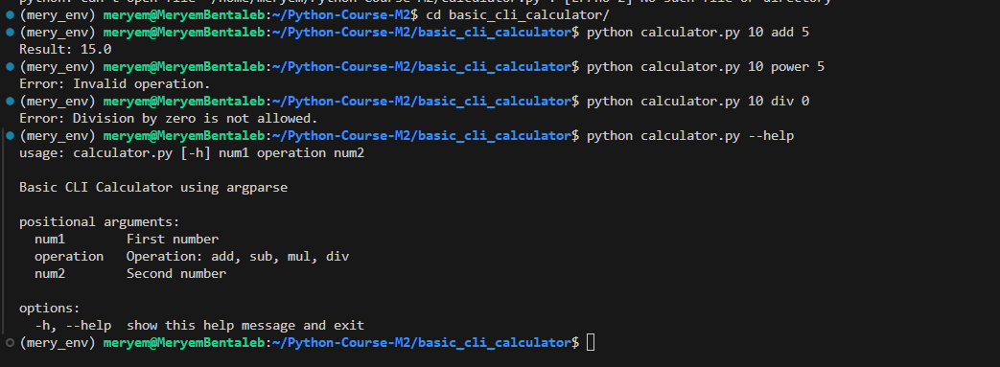

# 🧮 Basic CLI Calculator

A simple command-line calculator built in Python using `argparse`.  
Supports basic operations: addition, subtraction, multiplication, and division.

---

## 🚀 Getting Started

### 🔧 Prerequisites

- Python 3.x installed
- Git (optional, for cloning)

### 📦 Installation

```bash
# Clone your fork
git clone https://github.com/MeryembentalebEJ/Python-Course-M2.git

# Go to the project folder
cd Python-Course-M2/basic_cli_calculator

```
### ⚙️ Usage

```bash
python calculator.py <num1> <operation> <num2>
```
### ✅ Supported Operations

*add : Addition*
*sub : Subtraction*
*mul : Multiplication*
*div : Division*

### 🧪 Example Runs

```bash
python calculator.py 10 add 5
# Output: Result: 15.0

python calculator.py 10 sub 3
# Output: Result: 7.0

python calculator.py 10 div 0
# Output: Error: Division by zero is not allowed.

python calculator.py 10 power 5
# Output: Error: Invalid operation.
```

### 🆘 Help
To see help message:

```bash
python calculator.py --help
```
## 🖥️ Exemple en action

Voici une exécution de la calculatrice CLI :


